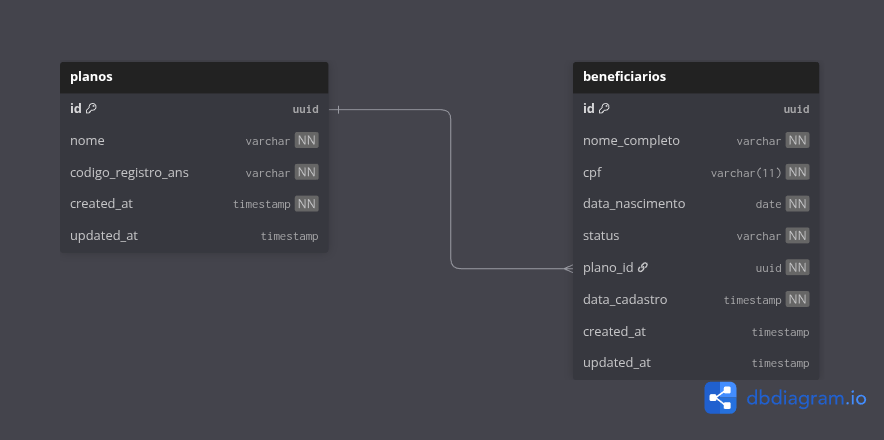

# API de Beneficiários
 API web para gerenciamento de planos e beneficiários.

## Diagrama do banco de dados


---

## 🚀 Tecnologias Utilizadas

*   **.NET 9** (C#)
*   **PostgreSQL** (Banco de Dados)
*   **Dapper** (Micro-ORM)
*   **Entity Framework Core** (Utilizado para inicialização e setup do banco)
*   **Swagger** (Documentação interativa)
*   **xUnit** (Testes de Unidade)
*   **Docker & Docker Compose** (Containerização)

---

## 📋 Funcionalidades e Regras de Negócio

*   **CRUD de Planos e Beneficiários**.
*   **Validação de CPF:** Unicidade de CPF no sistema.
*   **Vínculo Obrigatório:** Todo beneficiário deve estar atrelado a um plano existente.
*   **Soft Delete (Bônus):** Exclusão lógica de beneficiários (o registro permanece no banco com flag `is_deleted`, mas não aparece nas listagens).
*   **Tratamento de Erros:** Retorno de status codes HTTP adequados (404, 409, 422, 500).

---

## ⚙️ Como Rodar o Projeto

### Pré-requisitos

*   [Git](https://git-scm.com/)
*   [Docker](https://www.docker.com/) e Docker Compose
*   [.NET SDK 9.0](https://dotnet.microsoft.com/download)


1.  **Clone o repositório:**
    ```bash
    git clone https://github.com/Douglascrc/4t-desafios.git
    cd 4t-desafios/backend
    ```

2.  **Suba o banco de dados:**
    ```bash
    docker compose up -d
    ```
2.  **Restaure as dependências e rode a aplicação:**
    ```bash
    cd src/Beneficiarios.Api
    dotnet restore
    dotnet run
    ```

3.  **Acesse o Swagger:**
    Disponível em `http://localhost:5000/swagger/index.html`.

---

## 🧪 Como Rodar os Testes

O projeto contém testes de unidade para validar as regras de negócio e o comportamento dos repositórios.

1.  Navegue até a pasta raiz ou a pasta de testes:
    ```bash
    cd tests/Beneficiarios.Api.Tests
    ```

2.  Execute os testes:
    ```bash
    dotnet test
    ```
---

## 🛠 Decisões de Projeto

*   **Dapper vs EF Core:** Optei por utilizar o **Dapper** nos Repositórios para as operações de CRUD visando maior performance e controle sobre as queries SQL, especialmente para atender aos requisitos de simplicidade do desafio. O EF Core foi mantido apenas para inicialização do contexto do banco.
*   **Soft Delete:** Implementado como campo booleano `deleted`. A API filtra automaticamente registros deletados nas operações de leitura (`GET`) e atualização (`PUT`), retornando 404 caso o recurso tenha sido excluído logicamente.
*   **Validações:** As validações de entrada (como campos obrigatórios) são feitas via `DataAnnotations` e `ModelState` (automático no .NET), enquanto regras de negócio (como duplicidade) são validadas nos Repositories.

## 📝 Exemplos de Requisições

**Criar Beneficiário:**
```json
POST /api/beneficiarios
{
  "nome_completo": "João da Silva",
  "cpf": "12345678900",
  "data_nascimento": "1990-01-01",
  "plano_id": "3fa85f64-5717-4562-b3fc-2c963f66afa6"
}
```
**Listar Planos:**
```bash
curl -X GET "http://localhost:5000/api/planos" | python3 -m json.tool
```
**Saída Esperada:**
```[
    {
        "id": "3fa85f64-5717-4562-b3fc-2c963f66afa6",
        "nome": "Plano Bronze",
        "codigoRegistroAns": "ANS-100001"
    },
    {
        "id": "82a24fbf-21ec-4fbf-a3d5-8ed07dde9da7",
        "nome": "Plano Prata",
        "codigoRegistroAns": "ANS-100002"
    }
]
```
## Todos os Endpoints da API

### Beneficiários
* `POST /api/beneficiarios` - Criar um novo beneficiário
* `PUT /api/beneficiarios/{id}` - Atualizar beneficiário existente
* `DELETE /api/beneficiarios/{id}` - Deletar beneficiário (soft delete)
* `GET /api/beneficiarios/{id}` - Buscar beneficiário por ID
* `GET /api/beneficiarios` - Listar beneficiários com filtros (status, plano_id)

### Planos de Saúde
* `POST /api/planos` - Criar um novo plano de saúde
* `PUT /api/planos/{id}` - Atualizar plano de saúde existente
* `DELETE /api/planos/{id}` - Deletar plano de saúde
* `GET /api/planos/{id}` - Buscar plano de saúde por ID
* `GET /api/planos` - Listar planos de saúde